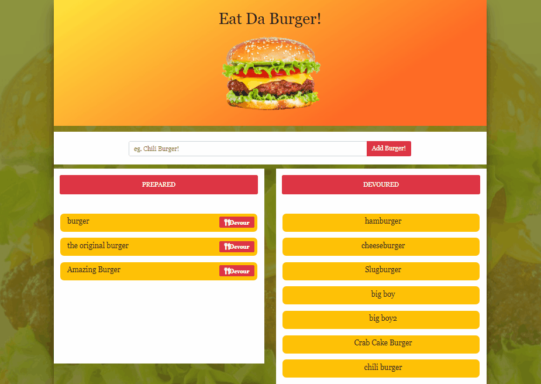

# Eat-Da-Burger
🍔 A burger logger with MySQL, Node, Express, Handlebars and a homemade ORM

### Technologies
This application makes use of the following technologies:

1. Javascript
2. NodeJS
3. GitHub
4. Heroku Cloud Hosting Platform
5. npmJS Packages
    * expressJS
    * mySQL
    * express-handlebars
6. JawsDB via Heroku using mySQL

# App Display
 * Eat-Da-Burger! is a restaurant app that lets users input the names of burgers they’d like to eat.

 * Whenever a user submits a burger’s name, the app will display the burger on the left side of the page – waiting to be devoured.

 * Each burger in the waiting area also has a `Devour it!` button. When the user clicks it, the burger will move to the right side of the page.

 * The app will store every burger in a database, whether devoured or not.

# Demo

Deploy link: https://afternoon-savannah-16664.herokuapp.com/

